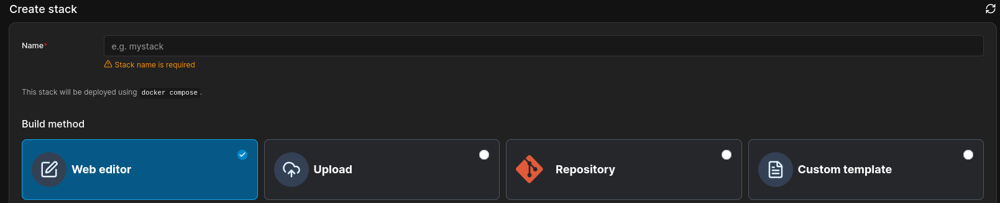

# redeploy-portainer-stack

> [!WARNING]
> As a side-effect, this action **will erase environment variables** added to your stack's definition.

Redeploy a Portainer CE **Web editor** stack from GitHub Actions CI.

Yes, it has to be a **Web editor** stack:



I made this because I needed a maintained action like this for use in my personal projects.

Here's a straight-to-the-point usage example:

```yaml
steps:
  - name: Build & publish Docker image
    # ...

  - name: Redeploy Portainer stack
    uses: nonk123/redeploy-portainer-stack@master
    with:
      url: ${{ secrets.PORTAINER_URL }}
      username: ${{ secrets.PORTAINER_USERNAME }}
      password: ${{ secrets.PORTAINER_PASSWORD }}
      stack_id: ${{ secrets.PORTAINER_STACK_ID }}
      endpoint_id: ${{ secrets.PORTAINER_ENDPOINT_ID }}
```

## Inputs

Set `with.username` and `with.password` to the login credentials for your Portainer instance. Use the [GitHub Actions secrets feature](https://docs.github.com/en/actions/how-tos/write-workflows/choose-what-workflows-do/use-secrets)! Never write them in plain text!

Then set `with.url`, `with.endpoint_id`, and `with.stack_id` to the values obtained from the stack URL in your browser. Here's an infographic based on a concrete URL example:

```plain
https://portainer.sv.q7x.ru/#!/13/docker/stacks/waste-it-bot?id=172+...
^- url -------------------^    ^- endpoint_id          stack_id --^
```
